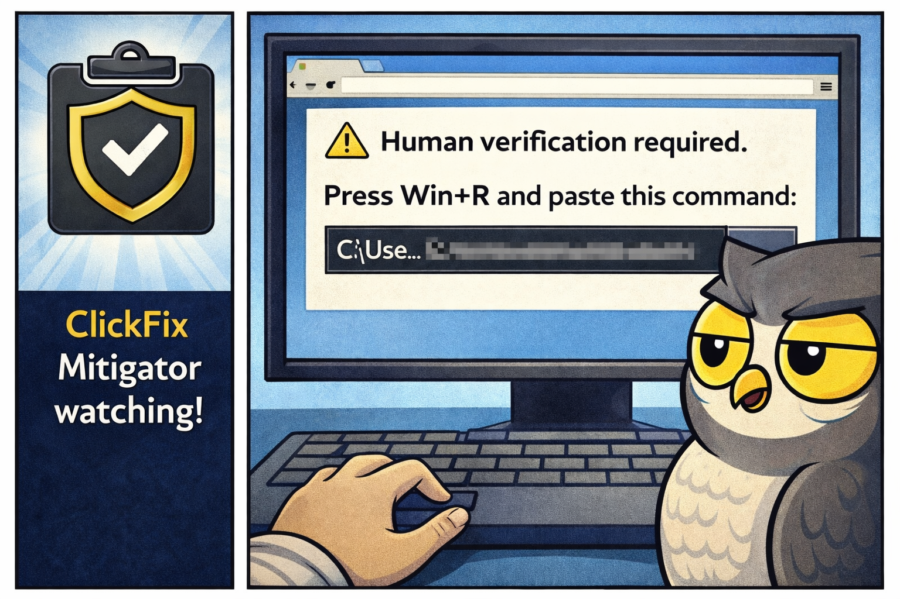
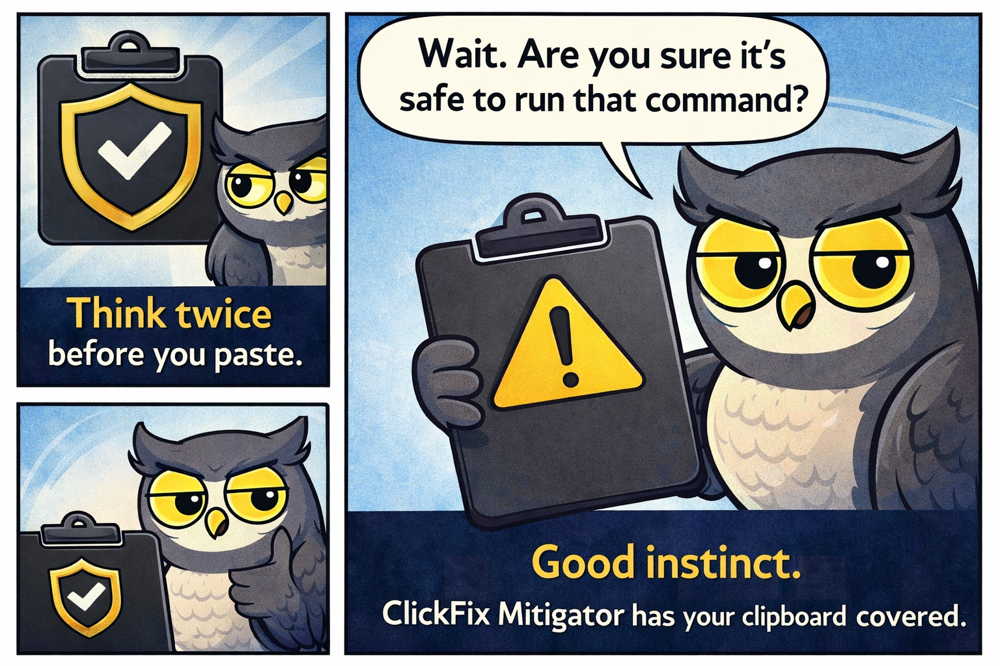
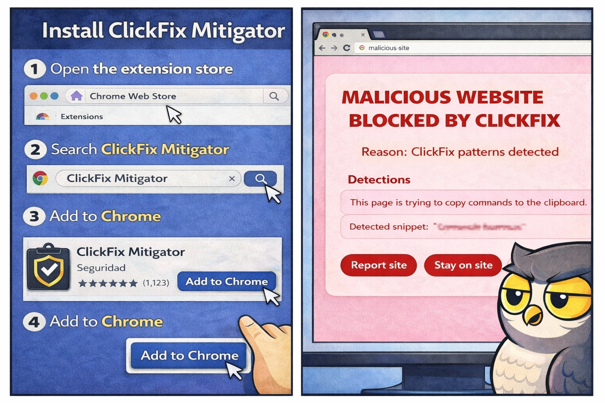
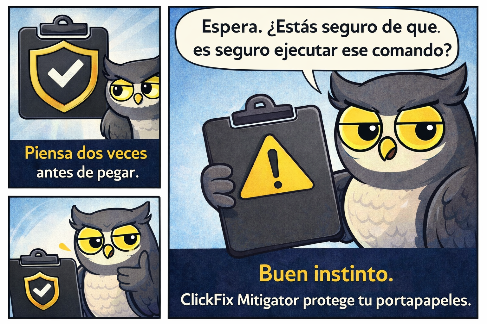
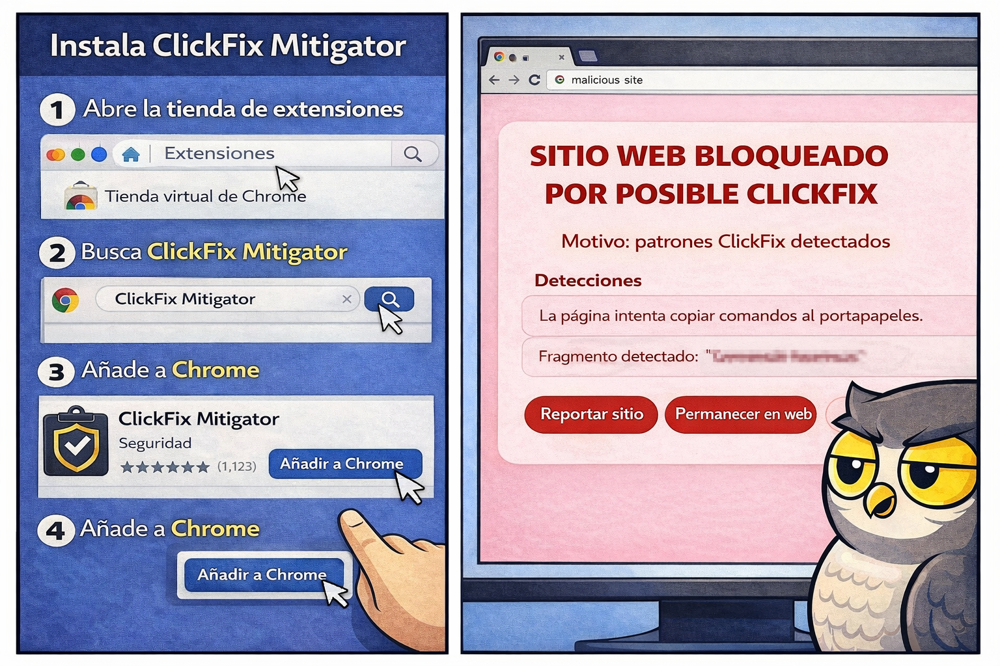

# ClickFix Mitigator

ClickFix Mitigator is a reference project for understanding and mitigating social engineering attacks that push users to run commands (ClickFix). It includes a browser extension and a Windows agent that can be used separately or together.

## Comic strip explaining the full flow:
<center><p>



</p></center>

## Components

- **Browser extension (MV3)**: detects common ClickFix patterns, clipboard/selection mismatches, and content that tries to induce **Win + R** usage.
- **Windows agent (Python)**: watches clipboard changes, paste events, and new processes to alert on suspicious commands.
- **Endpoint and dashboard**: `Web/ClickFix/clickfix-report.php` receives reports/stats and `Web/ClickFix/dashboard.php` shows a public summary with recent detections.

> Note: the `agent.py` mitigator is under maintenance (testing).

## Quick start

### Extension

1. Go to `chrome://extensions` (Edge/Brave also work).
2. Enable **Developer mode**.
3. Choose **Load unpacked** and point to `browser-extension/`.
4. Open a test page, copy text, and verify alerts when clipboard content does not match.

More details in `browser-extension/README.md`.

### Windows agent

```powershell
cd windows-agent
python -m venv .venv
.\.venv\Scripts\Activate.ps1
pip install -r requirements.txt
python agent.py
```

More details in `windows-agent/README.md`.

## Permissions and privacy

- The extension requests access to `<all_urls>` to inspect text and events on visited pages, plus clipboard permissions to validate selection/paste mismatches.
- The Windows agent reads the clipboard and process command lines to detect malicious patterns.

If you need to limit scope, review the permissions in `browser-extension/manifest.json` and the rules in `windows-agent/config.json`.

## Testing

- **Extension**: use the test HTML files in `browser-extension/` (for example, `demo-*.html`) and validate that notifications appear when copied/pasted text changes or matches suspicious rules.
- **Agent**: tune the rules in `windows-agent/config.json` and run simulated commands to verify toasts.
- **PoCs**: the `demo/` folder contains additional ClickFix PoCs to simulate real campaigns.

## Project status

This repository is an educational reference. For production, add automated tests, a secure deployment flow, and clear usage policies. Improvements are welcome as long as they fit the project goals.

---

# ClickFix Mitigator

ClickFix Mitigator es un proyecto de referencia para entender y mitigar ataques de ingeniería social que empujan a ejecutar comandos (ClickFix). Incluye una extensión de navegador y un agente para Windows que pueden usarse por separado o juntos.

## Cómic que explica el flujo completo:
<center><p>



</p></center>

## Componentes

- **Extensión de navegador (MV3)**: detecta patrones típicos de ClickFix, discrepancias entre selección y portapapeles, y contenido que intenta inducir el uso de **Win + R**.
- **Agente de Windows (Python)**: vigila cambios del portapapeles, eventos de pegado y nuevos procesos para alertar sobre comandos sospechosos.
- **Endpoint y dashboard**: `Web/ClickFix/clickfix-report.php` recibe reportes/estadísticas y `Web/ClickFix/dashboard.php` muestra un resumen público con detecciones recientes.

> Nota: el mitigador `agent.py` está en mantenimiento (en pruebas).
## Servidor (PHP)

El endpoint usa SQLite en `Web/ClickFix/data/clickfix.sqlite`. Asegúrate de que el directorio `Web/ClickFix/data/` sea escribible por el servidor web. El esquema está en `Web/ClickFix/data/clickfix.sql`.

```bash
mkdir -p Web/ClickFix/data
sqlite3 Web/ClickFix/data/clickfix.sqlite < Web/ClickFix/data/clickfix.sql
chmod 775 Web/ClickFix/data
```

Si el proceso PHP no puede escribir, revisa permisos/propietario de `data/` y el archivo `.sqlite`.

### Ejemplo de envío en Python

```python
import requests
from datetime import datetime, timezone

CLICKFIX_REPORT_URL = "https://tu-dominio.com/clickfix-report.php"

payload = {
    "url": "https://ejemplo.com/alerta",
    "hostname": "ejemplo.com",
    "timestamp": datetime.now(timezone.utc).isoformat(),
    "message": "Detección de comando sospechoso",
    "detectedContent": "powershell -nop -w hidden -enc ...",
    "full_context": "Contenido completo detectado ...",
    "signals": {
        "mismatch": False,
        "commandMatch": True,
        "winRHint": False,
        "winXHint": False,
        "browserErrorHint": False,
        "fixActionHint": False,
        "captchaHint": False,
        "consoleHint": True,
        "shellHint": True,
        "pasteSequenceHint": False,
        "fileExplorerHint": False,
        "copyTriggerHint": False,
        "evasionHint": False,
    },
}

response = requests.post(CLICKFIX_REPORT_URL, json=payload, timeout=10)
print(response.status_code, response.text)
```

## Inicio rápido

### Extensión

1. Ve a `chrome://extensions` (Edge/Brave también funciona).
2. Activa **modo desarrollador**.
3. Selecciona **Cargar sin empaquetar** y apunta a `browser-extension/`.
4. Abre una página de pruebas, copia texto y verifica las alertas cuando el contenido del portapapeles no coincide.

Más detalles en `browser-extension/README.md`.

### Agente de Windows

```powershell
cd windows-agent
python -m venv .venv
.\.venv\Scripts\Activate.ps1
pip install -r requirements.txt
python agent.py
```

Más detalles en `windows-agent/README.md`.

## Permisos y privacidad

- La extensión solicita acceso a `<all_urls>` para inspeccionar texto y eventos en las páginas visitadas, y permisos de portapapeles para validar discrepancias entre selección y pegado.
- El agente de Windows lee el portapapeles y la línea de comandos de procesos para detectar patrones maliciosos.

Si necesitas limitar el alcance, revisa los permisos en `browser-extension/manifest.json` y las reglas en `windows-agent/config.json`.

## Pruebas

- **Extensión**: usa los HTML de prueba en `browser-extension/` (por ejemplo, `demo-*.html`) y valida que las notificaciones aparezcan cuando el texto copiado/pegado cambia o coincide con reglas sospechosas.
- **Agente**: ajusta las reglas en `windows-agent/config.json` y ejecuta comandos simulados para verificar los toasts.
- **PoCs**: la carpeta `demo/` contiene PoCs de ClickFix adicionales para simular campañas reales.

## Estado del proyecto

Este repositorio es una referencia educativa. Para un entorno real, conviene añadir pruebas automatizadas, un flujo de despliegue seguro y políticas claras de uso. Cualquier mejora es bienvenida siempre que tenga sentido para el objetivo del proyecto.
